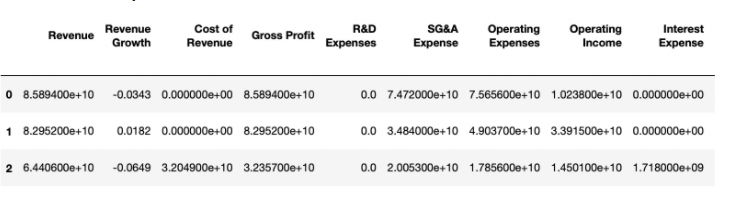
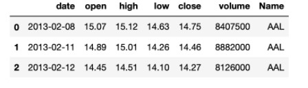
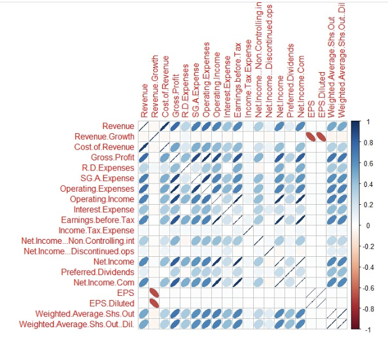
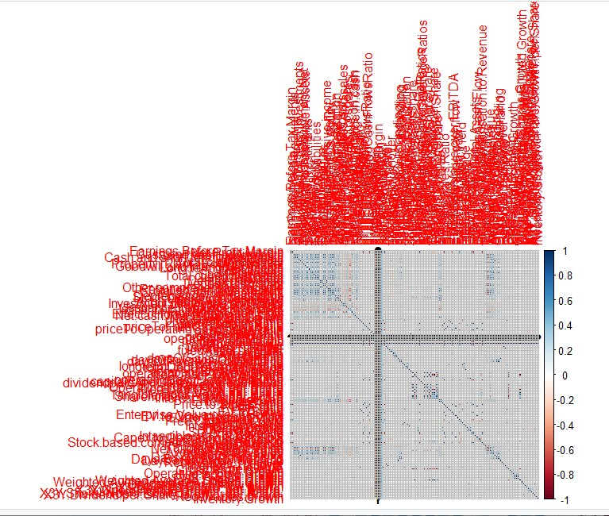
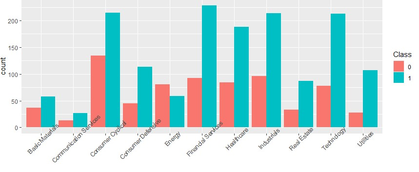
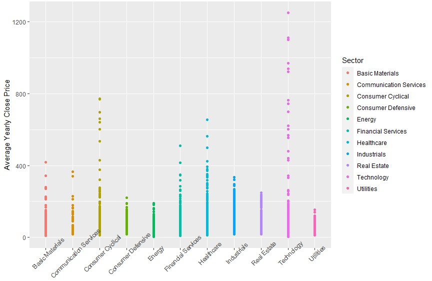

# ORIE 5741 Project Midterm Review

Juyoung Cha, Shuoqi Zhang, Susan Wu

## Data Processing

Our project goal is to construct two prediction models:

(1) Regression model to predict the mean closing prices

(2) Classification model to predict whether or not the stock prices will increase

To achieve this goal, the following two datasets have to be merged:

**(1) Financial indicators dataset:**

5 separate US stocks datasets containing 225 annual financial indicators for each year between 2014 and 2018




**(2) Price dataset: Daily stock prices of S&P Top 500 stocks between 2014 and 2018**




Before merging the datasets, we performed data cleaning for each dataset separately.

In our financial indicators dataset, we firstly combined 5 separate datasets for each of 5 years into an integrated data frame as the original version of our matrix X. After the combination step, we moved into the cleaning stage. Firstly, we dealt with missing values in the data frame. Columns that have a portion, greater than 25%, of missing values in their entries were detected and deleted from the data frame, since the inclusion of this kind of columns will negatively affect future predictions. Then we checked if each firm has a complete record of data for 5 years. After these two steps, there were 188 columns (features) and 3706 firms remaining in the data frame, with the proportion of missing values in the data frame dropping from 12% to 3%. 

After the main missing values were removed, we imputed the remaining missing values with the mean of each feature in each sector to ensure the continuity of our data. From the financial perspective, the mean of a specific factor of firms in the same field can well reflect an overall circumstance on that factor. Therefore, instead of replacing missing values with zero, means are more precise for future predictions. The next step we took was dealing with outliers. Outliers represent abnormal situations in the market, and will affect the coefficients to an extreme extent, which will lead to a bad prediction model. We classified data points of indicators as outliers if it is over 99 quantile or less than 1 quantile in each sector for each year instead of dropping the outliers for the whole five year at one time, then replaced those outliers with 99 quantile if it’s over 99 quantile, and 1 quantile if it’s less than 1 quantile. 

In the price dataset, we found that there are a total of 11 rows with partially missing values. However, none of the missing values came from the closing price column, the variable of our interest, so we did not remove any data from this dataset.

Next, we removed the outliers from the two datasets. In our financial indicators dataset, we

It was also important to remove the outliers in our price dataset, as the outliers affect the yearly mean closing prices of stocks. However, the outliers had to be searched for each stock, as stocks have different ranges of prices. For each stock, we first defined the outliers as:


<h4 align="center">
```math
    $[Q_1 - 1.5IQR, Q_3 + 1.5IQR]$
```</h4>

But this criteria classified more than 10% of the data as outliers. Thus, instead of arbitrarily modifying the conventional definition of outliers using IQR, we instead defined the outliers as points that are outside of 99% confidence interval of the mean by using the z-score of 2.576.

<h4 align="center">
```math
    $[\bar x - z*\frac {s} {\sqrt n}, \bar x + z*\frac {s} {\sqrt n}]$
```</h4>

Using this method, we removed 3665 out of 619040 rows, which is 0.6% of our data.

After this step, our data has 190 features and 2230 entries. Next, we performed the exploratory data analysis and built basic regression models to further perform feature selection.


## Exploratory Data Analysis

Since there are 190 features, the focus of our analysis should be to prevent overfitting (rather than underfitting.) To prevent overfitting, our model should be sparse. To achieve this, we first checked the collinearity of all 190 features by making two correlation matrices. In both graphs, color scales represent the extents of correlations according to each correlation value. The first graph includes 30 features, and the second graph includes 130 features. As we can see from the two graphs, there are many features that have high correlations paired with other features. We also calculated the correlation values and identified feature pairs with high correlations, for example, growth profit and operating income. We recorded and ran preliminary regression to remove the feature pairs with high dependency. The feature removal will be shown in the preliminary modeling part.





To start with, we visualized these two targets for different sectors. The first graph is about the number of stocks that are worth buying in each sector. The second graph shows the average closing stock price of each firm grouped by sectors. As we can see from these two graphs, the distribution of the class and average closing prices for sectors are significantly different across each sector. So in the future, we will choose to do modelling in certain sectors individually to perform more precise analyses.





## Preliminary Modeling

Our goal is to develop two models:

First of all, we partitioned our data into training and testing datasets. We constructed our training dataset by randomly selecting 80% of the stocks between 2014 and 2017 to build our model, and we will use the test RMSE to measure the quality of our model and prevent overfitting. Once we develop our best model, we will predict the mean closing prices of all 500 stocks in 2018, and test our model effectiveness by calculating the errors using the actual stock prices.

**(1) Regression model to predict the mean closing prices**

For the first step, we constructed the basic linear regression model on the closing price. From the linear regression model for the close price, we firstly constructed the model with all features. Then we removed features with NA coefficients, which indicate high collinearity with the other remaining features. Next, we performed stepwise regression to narrow the range of variables that should be included in models, so that we only keep the significant variables with p-values less than 0.05. This enabled us to remove 130 features from 188 features. 

**(2) Classification model to predict whether or not the stock prices will increase**

For the “class” classification, we  initially performed the logistic regression model to remove features in a way that is similar to what we did in the close price model. Only 25 indicators remained through this process.

Further feature selections and modeling will be applied on these two models.

## Plan for Improvement

Since our data is very high-dimensional, we still have many features in our models even after applying feature selection methods. In our next step, we will focus on further reducing the dimension of our data to avoid overfitting and reduce the variance of both regression and classification models. We plan to achieve this through lasso, which will select fewer features and give us more sparse models. We will also try other feature selection techniques.

For our regression model, we will try to find the best model by comparing our linear model with other models. For example, we will also use feature transformation to improve the accuracy of our model like using the quadratic regression.

For our classification model, we will also fit different models such as tree and KNN and compare their test error rates to find the best model.

